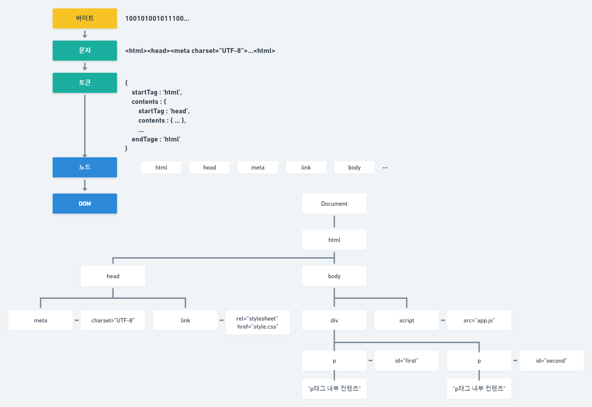
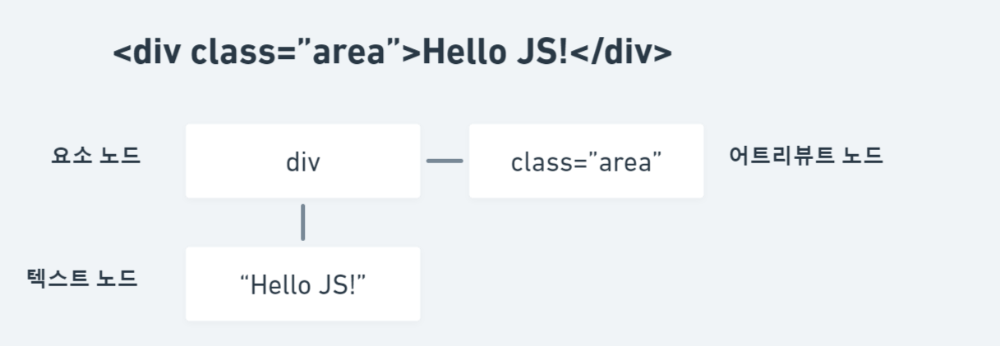

# 1. DOM (Document Object Model)

## 브라우저 렌더링(browser rendering)

브라우저는 HTML, CSS, 자바스크립트로 작성 된 텍스트 문서를 파싱하여 브라우저 렌더링한다.

- 파싱(parsing) : 프로그래밍 언어의 문법에 맞게 작성 된 텍스트 문서를 읽어 들여 실행하기 위해 텍스트 문서의 문자열을 토큰으로 분해하고, 토큰에 문법적 의미와 구조를 반영하여 트리 구조의 자료 구조인 파스 트리(parse tree)를 생성하는 일련의 과정이다. 일반적으로 파싱 이후 파스 트리를 기반으로 중간 언어인 바이트 코드를 생성하고 실행한다.

- 렌더링(rendering) : HTML, CSS, 자바스크립트로 작성 된 문서를 파싱하여 브라우저에 시각적으로 출력하는 것이다.
 
## DOM(Document Object Model)
브라우저 렌더링 엔진은 HTML 문서를 파싱하여 브라우저가 이해할 수 있는 자료 구조인 DOM을 생성한다.



HTML 문서를 파싱한 결과물로서 생성 된 DOM은 HTML 문서의 구조와 정보뿐만 아니라 HTML 요소와 스타일 등을 변경할 수 있는 프로그래밍 인터페이스로서 DOM API를 제공한다. 자바스크립트에서 DOM API를 사용하면 이미 생성 된 DOM을 동적으로 조작할 수 있다.

## 노드 (node)

HTML 요소는 렌더링 엔진에 의해 파싱되어 DOM을 구성하는 요소 노드 객체로 변환된다. 이때 HTML 요소의 어트리뷰트는 어트리뷰트 노드로,
HTML 요소의 텍스트 콘텐츠는 텍스트 노드로 변환 된다.



HTML 요소 간에는 중첩 관계에 의해 계층적인 부자 관계가 형성 된다.
이러한 HTML 요소 간의 부자 관계를 반영하여 HTML 문서의 구성 요소인 HTML 요소를 객체화한 모든 노드 객체들을 트리 자료 구조로 구성한다.
노드 객체들로 구성 된 트리 자료 구조를 DOM(Document Object Model)이라 한다. 이에 DOM 트리라는 명칭을 쓰기도 한다.

# 1-1. get element node (노드 취득)

## 1-1-1. use id (id 사용)
- Document.prototype.getElementById 메서드는 인수로 전달한 id 어트리뷰트 값을 갖는 하나의 요소 노드를 탐색하여 반환한다.
- 문서 내에 중복 된 id 값을 갖는 HTML 요소가 여러 개 존재하더라도 에러가 발생하지는 않지만 해당 id 값을 갖는 첫 번째 요소 노드만 반환한다. 
- id 값을 갖는 HTML 요소가 존재하지 않는 경우 null을 반환한다.

```html
<div id="area1" class="area">
    div 영역
    <p id="area2">p 영역</p>
</div>
<div id="area1" class="area">
     div 영역
</div> 
```

```js
// 요소 노드 취득
const $elem = document.getElementById('area1');
// 요소의 스타일 속성을 이용하여 배경색 변경
$elem.style.backgroundColor = 'skyblue';
// => 해당 아이디를 가진 요소들 중 첫 번째 요소만 스타일 속성이 적용된다.

// 2) 하지만 id 값과 동일한 이름의 전역 변수가 있을 경우 이름 충돌이 있어 지양하는 것이 좋다.
// Uncaught TypeError: Cannot set properties of undefined (setting 'backgroundColor')
// let area2 = 10; // 작성하여 위의 오류 확인 후 주석
// 1) id 속성 값을 그대로 딴 전역 변수를 이용한 접근도 가능하다.
area2.style.backgroundColor = 'blue';

// id 값을 갖는 HTML 요소가 존재하지 않는 경우 null 반환
const $noElem = document.getElementById('area3');
console.log($noElem);
```

## 1-1-2. use tag name (태그명 사용)

- Document.prototype/Element.prototype.getElementsByTagName 메서드는 인수로 전달한 태그 이름을 갖는 모든 요소 노드들을 탐색하여 반환한다.
- 메서드 이름의 Elements가 복수형인 것에서 알 수 있듯 여러 개의 요소 노드 객체를 갖는 DOM 컬렉션 객체인 HTMLCollection 객체를 반환한다.
- 해당 태그 이름을 갖는 요소가 존재하지 않을 경우 빈 HTMLCollection 객체 반환한다.

```html
<ul id="food">
    <li>김치찌개</li>
    <li>된장찌개</li>
    <li>고등어구이</li>
</ul>
<ul id="drink">
    <li>커피</li>
    <li>콜라</li>
    <li>우유</li>
</ul>
```

```js
// Document.prototype.getElementsByTagName
// DOM 전체에서 li 태그를 모두 탐색하여 반환 
const $lists = document.getElementsByTagName("li");
console.log($lists); // HTMLColleciton - 유사 객체 배열, 이터러블
console.log($lists.length); // length를 가지고 있다.

// 기본 반복문을 통한 배경색 변경 처리
let changeColor = 0;
for(let i = 0; i < $lists.length; i++) {
    $lists[i].style.backgroundColor = "rgb(130,220," + changeColor + ")";
    changeColor += 50;
}

// HTMLCollection 객체를 배열로 변환하여 순회하며 color 프로퍼티 값을 변경한다.
Array.from($lists).forEach(list => list.style.color = 'blue');

// Element.prototype.getelementsByTagName
// $drink의 자손 노드 중에서 li 태그 탐색
const $drink = document.getElementById('drink');
const $listsFromDrink = $drink.getElementsByTagName('li');
console.log($listsFromDrink);

Array.from($listsFromDrink).forEach(list => list.style.color = 'red');

// 해당 태그 이름을 갖는 요소가 존재하지 않을 경우 빈 HTMLCollection 객체 반환
const $noElem = $drink.getElementsByTagName('a');
console.log($noElem);
```

## 1-1-3. use class name (클래스명 사용)
- Document.prototype/Element.prototype.getElementsByClassName 메서드는 인수로 전달한 class 어트리뷰트 값을 갖는 모든 요소 노드들을 탐색하여 반환한다.
- 인수로 전달할 class 값은 공백으로 구분하여 여러 개의 class를 지정할 수 있다.
- 메서드 이름의 Elements가 복수형인 것에서 알 수 있듯 여러 개의 요소 노드 객체를 갖는 DOM 컬렉션 객체인 HTMLCollection 객체를 반환한다.
- 해당 class를 갖는 요소가 존재하지 않을 경우 빈 HTMLCollection 객체 반환한다.

```html
<ul id="available">
    <li class="drink coffee">커피</li>
    <li class="drink coke">콜라</li>
    <li class="drink milk">우유</li>
</ul>
<ul id="unavailable">
    <li class="drink soju">소주</li>
    <li class="drink beer">맥주</li>
</ul>
```

```js
// Document.prototype.getElementsByClassName
// DOM 전체에서 class 값이 drink 인 요소 노드를 모두 탐색하여 반환 
const $drinks = document.getElementsByClassName("drink");
console.log($drinks); // HTMLColleciton - 유사 객체 배열, 이터러블
console.log($drinks.length); // length를 가지고 있다.

Array.from($drinks).forEach(drink => drink.style.color = 'red');

// DOM 전체에서 class 값이 drink coffee 인 요소 노드를 모두 탐색하여 반환 
const $coffee = document.getElementsByClassName('drink coffee');
console.log($coffee);

// Element.prototype.getElementsByClassName
// $available의 자식 노드들 중 class 값이 drink 인 요소 노드를 모두 탐색하여 반환 
const $available = document.getElementById('available');
const $availableDrinks = $available.getElementsByClassName('drink');
console.log($availableDrinks);

Array.from($availableDrinks).forEach(drink => drink.style.color = 'blue');

// 해당 class를 갖는 요소가 존재하지 않을 경우 빈 HTMLCollection 객체 반환
const $noElem = $available.getElementsByClassName('soju');
console.log($noElem);
```

## 1-1-4. use css (선택자 사용)
- Document.prototype/Element.prototype.querySelector 메서드는 인수로 전달한 CSS 선택자를 만족시키는 하나의 요소 노드를 탐색하여 반환한다.
- CSS 선택자를 만족시키는 요소 노드가 존재하지 않는 경우 null을 반환한다.
  
```html
<div class="area">
    <p>first</p>
</div>
<div class="area">
    <p>second</p>
</div>
```

```js
// Document.prototype.querySelector
// DOM 전체에서 class 어트리뷰트 값이 area인 첫 번째 요소 노드를 탐색하여 반환
const $area = document.querySelector(".area");
console.log($area);

// 취득한 요소 노드의 backgorundColor 프로퍼티 값 변경
$area.style.backgroundColor = 'gray';

// Element.prototype.querySelector
// $area의 자식 노드 중 p 태그인 첫 번째 요소 노드 탐색하여 반환
const $first = $area.querySelector('p');
console.log($first);

$first.style.color = 'white';

// CSS 선택자를 만족시키는 요소 노드가 존재하지 않는 경우 null 반환
const $noElem = document.querySelector(".noElem");
console.log($noElem);
```
- Document.prototype/Element.prototype.querySelectorAll 메서드는 인수로 전달한 CSS 선택자를 만족시키는 모든 요소 노드를 탐색하여 반환한다.
- 여러 개의 요소 노드 객체를 갖는 DOM 컬렉션 객체인 NodeList 객체를 반환한다.
- NodeList 객체는 forEach 메서드를 사용할 수 있다.
- CSS 선택자를 만족시키는 요소가 존재하지 않는 경우 빈 NodeList 객체를 반환한다.
```html
<ul id="list">
    <li class="drink">커피</li>
    <li class="drink">콜라</li>
    <li class="food">김치찌개</li>
    <li class="food">된장찌개</li>
</ul>
```
```js
// Document.prototype.querySelectorAll
// DOM 전체에서 ul 태그의 자손 li 태그들을 모두 NodeList로 반환
const $lists = document.querySelectorAll('ul > li');
console.log($lists);    // NodeList - 유사 객체 배열, 이터러블

// NodeList는 forEach 메소드 사용 가능
$lists.forEach(list => list.style.backgroundColor = 'gray');

// list 하위 요소 중 food 클래스를 가진 모든 요소를 NodeList로 반환 
const $foodLists = document.getElementById('list').querySelectorAll('.food');
console.log($foodLists);

$foodLists.forEach(food => food.style.color = 'white');

// CSS 선택자를 만족시키는 요소가 존재하지 않는 경우 빈 NodeList 객체 반환
const $noElemList = document.querySelectorAll('.noElemList');
console.log($noElemList);
```

## 1-1-5. HTMLCollection과 NodeList

-   HTMLCollection과 NodeList는 DOM API가 여러 개의 결과 값을 반환하기 위한 DOM 컬렉션 객체이다.
- HTMLCollection과 NodeList는 모두 유사 배열 객체면서 이터러블이다. 
- 따라서 for...of 문으로 순회할 수 있으며 배열로 변환할 수 있다.
  
### HTMLCollection
- getElementsByTagName, getElementsByClassName 메서드가 반환하는 객체이다.
- 노드 객체의 상태 변화를 실시간으로 반영하는 살아있는(live) DOM 컬렉션 객체이다.
- HTMLCollection 객체는 실시간으로 노드 객체의 상태 변경을 반영하여 요소를 제거할 수 있기 때문에 for문으로 순회하면서 노드 객체의 상태를 변경하는 경우 주의해야 한다.
  - 반복문 역방향 순회 혹은 while문 사용 등을 통해 회피할 수 있다.
  - 하지만 HTMLCollection 객체를 사용하지 않고 배열로 변환하는 것이 권장 된다.

```css
.white { color : white; }
.black { color : black; }
```

```html
<ul>
    <li class='white'>착한 사람 눈에만 보이는 첫 번째 글</li>
    <li class='white'>착한 사람 눈에만 보이는 두 번째 글</li>
    <li class='white'>착한 사람 눈에만 보이는 세 번째 글</li>
</ul>
```

```js
const $whiteList = document.getElementsByClassName('white');
console.log($whiteList);

/* HTMLCollection 객체는 실시간으로 노드 객체의 상태 변경을 반영하여 요소를 제거할 수 있기 때문에 첫 번째 반복문(i == 0)을 통해 "첫 번째 글" 노드가 제거 되어 length가 3 -> 2 로 줄었고 마지막 턴이 된 두 번째 반목문(i == 1)을 통해 접근한 1번 인덱스는 "세 번째 글"이 되어 "두 번째 글"은 변경 className이 변경되지 않았다. 이처럼 for문으로 순회하면서 노드 객체의 상태를 변경하는 경우 주의해야 한다.*/
for(let i = 0; i < $whiteList.length; i++) {
    $whiteList[i].className = 'black';
}

/* 반복문 역방향 순회 혹은 while문 사용 등을 통해 회피할 수 있다. */
for(let i = $whiteList.length - 1; i >= 0; i--) {
    $whiteList[i].className = 'black';
}

let i = 0;
while($whiteList.length > 0) {
    $whiteList[i].className = 'black';
}

/* 하지만 HTMLCollection 객체를 사용하지 않고 배열로 변환하는 것이 권장 된다. */
Array.from($whiteList).forEach(list => list.className = 'black');
```

## NodeList
- querySelectorAll 메서드가 반환하는 객체이다. 
- 실시간으로 노드 객체의 상태를 변경하지 않기(non-live) 때문에 HTMLCollection의 부작용을 해결할 수 있다.
- NodeList 객체는 NodeList.prototype.forEach 메서드를 상속 받아 사용할 수 있다.
- NodeList.prototype은 forEach 외에도 item, entries, keys, values 메서드를 제공한다.
- 대부분의 NodeList는 non-live 객체로 동작하지만 childNodes 프로퍼티가 반환하는 NodeList 객체는 HTMLCollection 객체와 같이 실시간으로 노드 객체의 상태 변경을 반영하는 live 객체로 동작하므로 주의가 필요하다.

```css
.blue { color : blue; }
.red { color : red; }
```

```html
<ul id="lists">
    <li class='red'>빨간 휴지 줄까~ 파란 휴지 줄까~</li>
    <li class='red'>빨간 휴지 줄까~ 파란 휴지 줄까~</li>
    <li class='red'>빨간 휴지 줄까~ 파란 휴지 줄까~</li>
</ul>
```

```js
const $redList = document.querySelectorAll('.red');
// NodeList 객체는 NodeList.prototype.forEach 메서드를 상속 받아 사용할 수 있다.
$redList.forEach(list => list.className = 'blue');
```

```js
const $lists = document.getElementById('lists');

const { childNodes } = $lists;
// const childNodes = $lists.childNodes;
console.log(childNodes); // 공백 텍스트 노드를 포함해 7개

for(let i = 0; i < childNodes.length; i++) {
    // removeChild 메서드가 호출 될 때마다 NodeList 객체인
    // childNodes가 실시간으로 변경되어 1,3,5,7 요소만 삭제 된다.
    $lists.removeChild(childNodes[i]);
}

console.log(childNodes); // 1, 3, 5, 7 요소만 삭제 되어 li 3개
```

### 정리
노드 객체의 상태 변경과 상관 없이 안전하게 DOM 컬렉션을 사용하려면 HTMLCollection이나 NodeList 객체를 배열로 변환하여 사용하는 것을 권장한다.
각각의 객체가 메서드를 제공하지는 하지만 배열의 고차 함수만큼 다양한 기능을 제공하지 않는다.
두 객체 모두 유사 배열 객체이면서 이터러블이므로 스프레드 문법이나 Array.from 메서드를 사용하여 간단하게 배열로 변환할 수 있다.