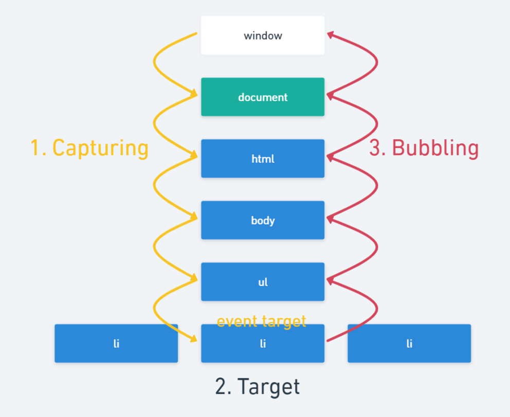

# 2-3. Event (이벤트 전파)

## 2-3-1. event propagation (이벤트 전파)
- 생성 된 이벤트 객체는 이벤트를 발생 시킨 DOM 요소인 이벤트 타깃(event target)을 중심으로 DOM 트리를 통해 전파된다. 
    1. 캡처링 단계(capturing phase) : 이벤트가 상위 요소에서 하위 요소 방향으로 전파 
    2. 타깃 단계(target phase) : 이벤트가 이벤트 타깃에 도달
    3. 버블링 단계(bubbling phase) : 이벤트가 하위 요소에서 상위 요소 방향으로 전파



```html
<ul id="drink">
    <li>커피</li>
    <li>콜라</li>
    <li>우유</li>
</ul>
```
```js
const $drink = document.getElementById('drink');

$drink.addEventListener('click', e => {
    // ul 영역 클릭 시 
    // 2 : 타깃 단계, 타깃도 현재 타깃도 ul로 출력
    // li 영역 클릭 시 
    // 3 : 버블링 단계(li->ul), 타깃은 li, 현재 타깃은 ul로 출력 
    console.log(e.eventPhase);  
    console.log(e.target);     
    console.log(e.currentTarget);   
});
```

- 이벤트  핸들러 어트리뷰트/프로퍼티 방식으로 등록한 이벤트 핸들러는 타깃 단계와 버블링 단계의 이벤트만 캐치할 수 있지만 addEventListener 메서드 방식으로 등록한 이벤트 핸들러는 3번째 인수로 true를 전달하면 캡처링 단계의 이벤트도 캐치할 수 있다. 
  
```html
<ul id="food">
    <li>김치찌개</li>
    <li>된장찌개</li>
    <li>고등어구이</li>
</ul>
```

```js
const $food = document.getElementById('food');

// 캡쳐링 단계 캐치
$food.addEventListener('click', e => {
    console.log(e.eventPhase);  
    console.log(e.target);     
    console.log(e.currentTarget);   
}, true);

// 버블링 단계 캐치
$food.addEventListener('click', e => {
    console.log(e.eventPhase);  
    console.log(e.target);     
    console.log(e.currentTarget);   
});

// ul 영역 클릭 시 타깃 단계 둘 다 캐치
// li 영역 클릭 시 1 캡처링 단계 -> 3 버블링 단계 캐치
```

## 2-3-2. event delegation (이벤트 위임)
- 비슷한 방식으로 여러 요소를 다뤄야 할 때 각 요소마다 핸들러를 할당하지 않고, 공통의 조상에 이벤트 핸들러를 단 하나만 할당해 여러 요소를 한 번에 다루는 이벤트 위임을 구현할 수 있다. 
- 공통 조상에 할당한 핸들러에서 event.target을 이용하면 실제 어디서 이벤트가 발생했는지 알 수 있으며 이를 이용해 이벤트를 핸들링할 수 있다. 

```html
<ul id="drink">
    <li>커피</li>
    <li>콜라</li>
    <li>우유</li>
</ul>
```
```js
// 각 li가 클릭 되었을 때 highlight라는 클래스가 없을 경우 부여하고 있을 경우 제거한다.
// li마다 이벤트 핸들러를 등록할수도 있지만 상위 요소인 ul에 한 번만 이벤트 핸들러를 등록한다. 
const $drink = document.getElementById('drink');

// ul이 클릭 되었을 때만이 아니라
// li가 클릭 되었을 때 버블링으로 인해 ul로 이벤트가 전파되며 이벤트 핸들러가 동작한다.
$drink.addEventListener('click', e => {
    // ul 영역 클릭 시에는 동작시키고 싶지 않으므로 li 인지 확인한다
    if(e.target.matches('li'))
        highlight(e.target);    // li가 클릭 되었을 경우 해당 li를 인자로 전달한다
});

function highlight(li) {
    // 클릭 된 li의 class에 highlight를 부여하거나 제거한다
    li.classList.toggle('highlight');
}
```