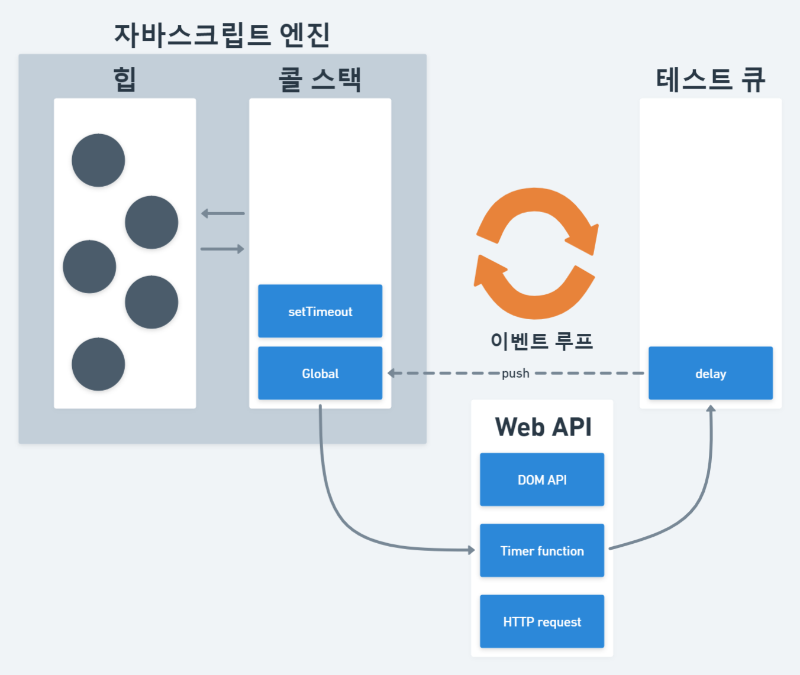

# 3. Timer (타이머)

## 3-1. timer method (타이머 메소드)

### 3-1-1. timeout

### setTimeout
- setTimeout 함수는 두 번째 인수로 전달 받은 시간(ms, 1/1000초)으로 단 한 번 동작하는 타이머를 생성한다. 
- 이후 타이머가 만료 되면 첫 번재 인수로 전달 받은 콜백 함수가 호출 된다. 
- 콜백 함수에 전달 해야 하는 인수가 존재하는 경우 세 번째 이후의 인수로 전달할 수 있다. 

```js
setTimeout(() => console.log('1초 지났지롱~'), 1000);

setTimeout((msg) => console.log(`1..2..3.. ${msg}`), 3000, '기다렸어?');
```

### clearTimeout
- setTimeout 함수는 생성된 타이머를 식별할 수 있는 고유한 타이머 id를 반환한다. 
- 반환한 id를 clearTimeout 함수의 인수로 전달하여 타이머를 취소할 수 있다. 
```js
const timerId = setTimeout(() => console.log('나는 곧 취소 될거야'), 2000);
console.log(timerId);   // 브라우저 환경에서는 숫자, Node.js 환경의 경우 객체
clearTimeout(timerId);
```
### 3-1-2. interval

### setInterval
- setInterval 함수는 두 번째 인수로 전달 받은 시간(ms, 1/1000초)으로 반복 동작하는 타이머를 생성한다. 
- 이후 타이머가 만료될 때마다 첫 번재 인수로 전달 받은 콜백 함수가 반복 호출 된다. 
- 이는 타이머가 취소될 때까지 계속된다.  
- 콜백 함수에 전달 해야 하는 인수가 존재하는 경우 세 번째 이후의 인수로 전달할 수 있다. 

### clearInterval
- setInterval 함수는 생성된 타이머를 식별할 수 있는 고유한 타이머 id를 반환한다. 
- 반환한 id를 clearInterval 함수의 인수로 전달하여 타이머를 취소할 수 있다. 
```js
let count = 1;
const timerId = setInterval(() => { 
    console.log(count);
    if(count++ === 5) clearInterval(timerId);
}, 1000);
```
## 3-2. asynchronous (비동기)

### 3-2-1. asynchronous (비동기)
- 자바스크립트는 한 번에 하나의 태스크만 실행할 수 있는 싱글 스레드 방식으로 동작한다.
- 때문에 처리에 시간이 걸리는 태스크를 실행하는 경우 블로킹(작업 중단)이 발생한다. 

### 동기 처리(synchronous)
- 현재 실행 중인 태스크가 종료할 때까지 다음에 실행 될 태스크가 대기하는 방식을 동기 처리라고 한다. 
- 장점 : 태스크를 순서대로 하나씩 처리하므로 실행 순서 보장
- 단점 : 앞선 태스크가 종료할 때까지 이후 태스크들이 블로킹 

```js
function sleep(func, delay) {
    const delayUntil = Date.now() + delay;

    while(Date.now() < delayUntil);

    func();
}

function delay() {
    console.log('실행 시간을 늦추고 싶어요!');
}

function start() {
    console.log('바로 실행하고 싶어요!');
}

// sleep 함수는 3초 이상 실행된다
sleep(delay, 3000);
// start 함수는 sleep 함수의 실행이 종료 된 이후에 호출 되므로 3초 이상 블로킹 된다
start();   
```

### 비동기 처리(asynchronous)
- 현재 실행 중인 태스크가 종료 되지 않은 상태라 해도 다음 태스크를 곧 바로 실행하는 방식을 비동기 처리라고 한다. 
- 장점 : 태스크가 블로킹 되지 않음
- 단점 : 태스크의 실행 순서가 보장되지 않음
- setTimeout, setInterval, 이벤트 핸들러, HTTP 요청 등은 비동기 처리 방식으로 동작한다.

```js
// 타이머 함수 setTimeout은 일정 시간이 경과한 이후에 콜백함수 delay를 호출한다
// 타이머 함수 setTimeout은 start 함수를 블로킹하지 않는다
setTimeout(delay, 3000);
start();
```


### 태스크 큐(task queue)
- setTimeout이나 setInterval과 같은 비동기 함수의 콜백 함수 또는 이벤트 핸들러가 일시적으로 보관되는 영역이다. 

### 이벤트 루프(event loop)
- 이벤트 루프는 콜 스택에 현재 실행 중인 실행 컨텍스트가 있는지, 그리고 태스크 큐에 대기 중인 함수(콜백 함수, 이벤트 핸들러 등)가 있는지 반복해서 확인한다. 
- 만약 콜 스택이 비어있고 태스크 큐에 대기 중인 함수가 있다면 이벤트 루프는 순차적(FIFO)으로 태스크 큐에 대기 중인 함수를 콜 스택으로 이동 시킨다. 이때 콜 스택으로 이동한 함수는 실행된다. 

- 비동기 함수인 setTimeout의 콜백 함수는 태스크 큐에 푸시 되어 대기하다가 콜 스택이 비게 되면, 다시 말해 전역 코드 및 명시적으로 호출 된 함수가 모두 종료하면 비로소 콜 스택에 푸시되어 실행된다. 
  
- 싱글 스레드 방식으로 동작하는 것은 브라우저가 아니라 브라우저에 내장 된 자바스크립트 엔진이라는 것에 주의한다.
- 만약 모든 자바스크립트 코드가 자바스크립트 엔진에서 싱글 스레드 방식으로 동작한다면 자바스크립트는 비동기로 동작할 수 없다.
- 자바스크립트 엔진은 싱글 스레드로 동작하지만 브라우저는 멀티 스레드로 동작한다.